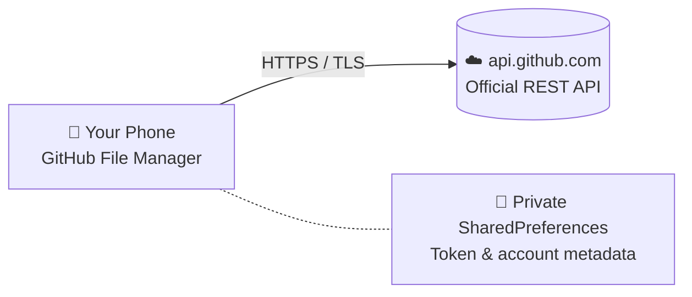

<!-- ======================= HEADER ======================= -->

 

 

  

🌐 **English** · [বাংলা](README.bn.md)

 

<!-- ======================= OVERVIEW ======================= -->
## 📖 Overview

**GitHub File Manager** is a modern, fast and secure open-source Android app that gives you full control of your GitHub repositories, files and directories — directly from your phone. Edit code, create files, upload ZIPs and manage branches without ever opening a desktop browser.

Works with both **private** and **public** repositories.

> 📦 **Package name:** `com.imalimrans.github.fileManager`

 

<!-- ======================= SCREENSHOTS ======================= -->
## 📱 Screenshots

<table>
  <tr>
    <td align="center"></td>
    <td align="center"></td>
    <td align="center"></td>
  </tr>
  <tr>
    <td align="center"></td>
    <td align="center"></td>
    <td align="center"></td>
  </tr>
</table>

 

<!-- ======================= FEATURES ======================= -->
## ✨ Features

<table>
<tr>
<td width="50%" valign="top">

### 👥 Multi-Account Switcher
Save multiple GitHub accounts (Personal, Work, Organization) and switch between them in a single tap.

</td>
<td width="50%" valign="top">

### 🗂️ Repository Explorer
Browse all public and private repos. Search, see stars, forks, default branch and last update, and open any branch directly.

</td>
</tr>
<tr>
<td valign="top">

### 🌳 Recursive File Tree
Detailed tree with grid/list views, file search, breadcrumb navigation and file-type icons (Code, Markdown, Image, PDF, Config…).

</td>
<td valign="top">

### ✏️ Code Editor & Commits
Edit code and text files in-app, write a custom commit message and push straight to GitHub. Unsaved-changes tracking prevents lost work.

</td>
</tr>
<tr>
<td valign="top">

### 📝 Live Markdown Viewer
GitHub-style rendering for `README.md` and every `.md` file.

</td>
<td valign="top">

### 📦 ZIP Upload & Extraction
Pick a ZIP on your phone and extract + upload it into any repo folder in one go.

</td>
</tr>
<tr>
<td valign="top">

### 🗑️ Bulk Delete & File Actions
Select multiple files to delete at once. Rename files, create new files and new directories.

</td>
<td valign="top">

### ⚡ Smart Caching
In-memory caching with fast Retrofit network calls for quick loading.

</td>
</tr>
</table>

 

<!-- ======================= GETTING STARTED ======================= -->
## 🚀 Getting Started

1. **Download** the latest APK from [GitHub Releases](https://github.com/IMALIMRANS/Github-File-Manager/releases/) or [APKPure](https://apkpure.com/Github-File-Manager/com.imalimrans.github.fileManager).
2. **Create a token** with all required scopes pre-selected:

   

3. **Paste** the token into the app and log in. Done 🎉

📘 Full walkthrough: [Setup Guide & Blog](https://imalimrans.pages.dev/blog-posts/GithubFileManagerapk)

 

<!-- ======================= TOKEN SCOPES ======================= -->
## 🔑 Token Scopes Explained

| Scope | Why it's needed |
|:------|:----------------|
| `repo` | Full control of private and public repositories — view, edit, create and delete files. |
| `read:user` | Show your profile name, username and avatar, and verify your account. |
| `user:email` | Attach your GitHub email as Git authorship when you commit from the app. |
| `workflow` | Edit CI/CD files inside `.github/workflows`. |

<b>⏳ Token expiration — what happens and how to avoid it (click to expand)</b>

 

**Why does GitHub set an expiry?**
For security: classic tokens default to 30/60/90 days and fine-grained tokens have a fixed lifetime, so a leaked token eventually becomes useless on its own.

**What happens when a token expires?**
1. The GitHub API returns `401 Unauthorized` / `Bad credentials`.
2. The app shows a clear "token expired" notice when loading or editing files.
3. Go to **Settings → Update Token**, paste a new token and you're instantly reconnected — no need to remove the account or reinstall.

**How to avoid expiry**
GitHub Settings → Personal Access Tokens (Classic) → **Expiration** → choose **No expiration**.

> ⚠️ Keep your token private and never share it with anyone.

 

<!-- ======================= SECURITY ======================= -->
## 🔒 Security & Architecture

| | |
|:--|:--|
| 🚫 **Zero intermediary server** | No backend or middleman database. All communication is directly between your phone and the official GitHub REST API (`https://api.github.com`), encrypted over HTTPS/TLS. |
| 🔐 **Local private storage** | Your Personal Access Token and account metadata live only in the app's private `SharedPreferences`. No other app or person can read them. |
| 🔍 **Open-source transparency** | 100% Kotlin + Jetpack Compose, fully public. Anyone can audit the code — no backdoors, no data tracking. |

 

<!-- ======================= TECH STACK ======================= -->
## 🛠️ Tech Stack

| Layer | Technology |
|:------|:-----------|
| Language | Kotlin 100% |
| UI | Jetpack Compose (Material Design 3) |
| Architecture | MVVM + Clean Data Layer |
| Async | Kotlin Coroutines + StateFlow / SharedFlow |
| Networking | Retrofit 2 + OkHttp 3 (Bearer Token Interceptor) |
| JSON | Moshi (Kotlin CodeGen & Reflect) |
| Image loading | Coil Compose |
| Target | Android 7.0+ (API 24+) |

 

<!-- ======================= LINKS ======================= -->
## 🔗 Links

| | |
|:--|:--|
| 🌐 Website | [imalimrans.pages.dev/GithubFileManager](https://imalimrans.pages.dev/GithubFileManager) |
| 🧑‍💻 Developer portal | [imalimrans.pages.dev](https://imalimrans.pages.dev/) |
| 📘 Setup guide | [Blog post](https://imalimrans.pages.dev/blog-posts/GithubFileManagerapk) |
| 🔐 Privacy Policy | [Read](https://imalimrans.pages.dev/GithubFileManager/privacy-policy) |
| 📄 Terms & Conditions | [Read](https://imalimrans.pages.dev/GithubFileManager/terms) |
| 💻 Source code | [GitHub Repository](https://github.com/IMALIMRANS/Github-File-Manager) |
| ⬇️ Latest APK | [Releases](https://github.com/IMALIMRANS/Github-File-Manager/releases/) |

 

## ⭐ Support

If this app helps you, please **star the repo** — it keeps the project going!

  

Made with ❤️ by <a href="https://github.com/IMALIMRANS"><b>IMALIMRANS</b></a>

